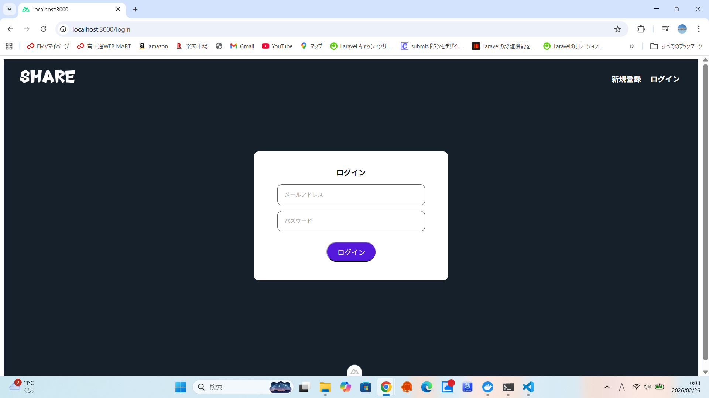
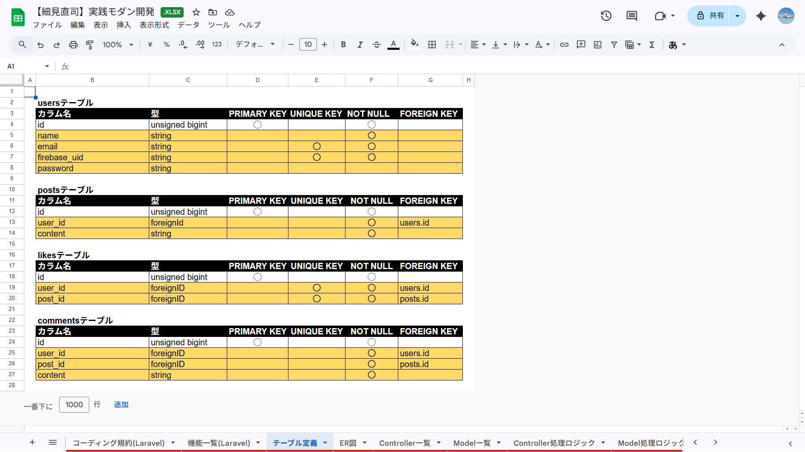

README.md# SNSapp

概要説明（どんなアプリか）
・簡単な投稿とコメントを記入することが可能なSNSアプリです。

## 作成した目的

概要説明（なんで作成したか）
・

## アプリケーションURL

デプロイのURLを貼り付る

ログインなどがあれば、注意事項など

※デプロイしていなければ記載しなくて良い

## 他のリポジトリ

関連するリポジトリがあれば記載する

例） バックエンドのリポジトリ、フロントエンドのリポジトリ

## 機能一覧

- 例）ログイン機能
- 会員登録機能
- ログイン機能
- ログアウト機能
- 投稿一覧表示機能
- 投稿追加機能
- 投稿削除機能
- いいね追加・削除機能
- コメント表示機能
- コメント追加機能

## 使用技術（実行環境）

- 例）　Laravel　8.x（言語やフレームワーク、バージョンなどが記載されていると良い）

- nuxt 4.2.2
- vee-validate 4.15.1
- vue 3.5.26
- vue-router 4.6.4

## テーブル設計

## ER図

## 環境構築
前提条件：以下のツールがインストールされていることを確認してください。
- Docker / Docker Desktop
- Node.js (v18.x 以上推奨)
- Git

1.バックエンド (Laravel) の構築
 1-1.リポジトリのクローンを行います。
    git clone
    cd SNSapp

 1-2..env.exampleをコピーして.envを作成し、データベースやFirebaseの情報を設定します。
    cp .env.example .env

 1-3.Dockerコンテナの起動を行います。
    ./vendor/bin/sail up -d

 1-4.依存関係のインストールと初期設定を行います。
    sail composer install
    sail php artisan key:generate
    sail php artisan migrate

2.フロントエンド（Nuxt.js）の構築
 2-1.ディレクトリをnuxtfile/appまで移動します。
    cd nuxtfile/app

 2-2.依存関係のインストールを行います。
    yarn install

 2-3..env ファイルを作成し、APIのベースURLとFirebaseの設定を記述します。
    NUXT_PUBLIC_API_BASE=http://localhost/api
    FIREBASE_API_KEY=your_api_key
    ... (その他のFirebase設定)

 2-4.開発サーバーの起動を行います。
    yarn run dev

3.Firebaseの設定
 3-1.Firebase Consoleでプロジェクトを作成します。

 3-2.Authenticationを有効にして、「メール/パスワード」認証を許可してください。

 3-3.設定情報をフロントエンドの.envに反映させます。

## 他に記載することがあれば記述する

例） ## アカウントの種類（テストユーザーなど）